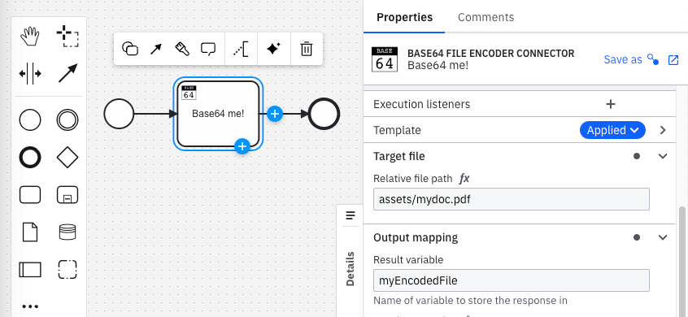
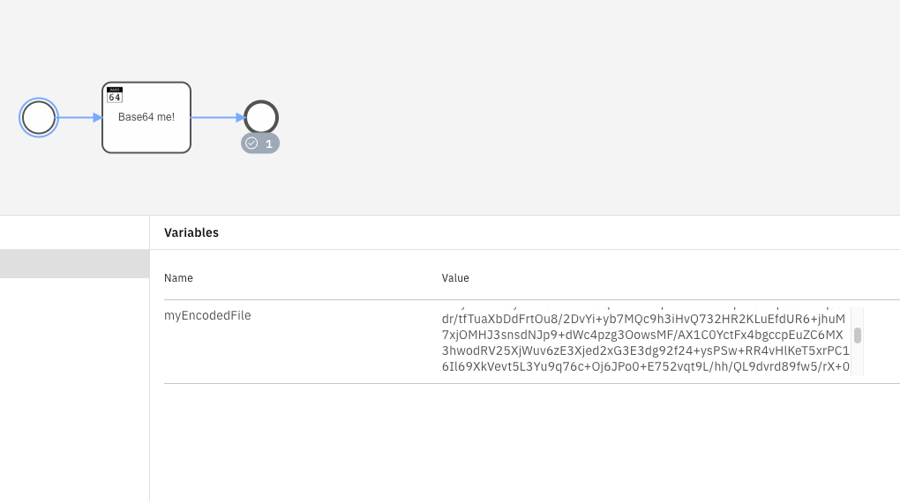

# Camunda 8 Base64 File Encoder Connector

This repository contains a custom connector for Camunda 8 that allows encoding files into Base64 format. The connector is designed to seamlessly integrate into your Camunda 8 workflow, enabling automated file encoding for a wide range of use cases.


## Usage/Examples



Can be very useful for encoding a file from your server to inject it into an HTTP request.

## Deployment

### Build
You can package the Connector by running the following command:

```bash
  mvn clean package
```
This will create the following artifacts:

- A thin JAR without dependencies.
- An fat JAR containing all dependencies, potentially shaded to avoid classpath conflicts. This will not include the SDK artifacts since those are in scope `provided` and will be brought along by the respective Connector Runtime executing the Connector.

### Installation

Install the conenctor on your system.

```bash
  mvn install
```

### Integration into your Java/Springboot application

First, you need a Java or Spring Boot application ready to integrate a Camunda connector.

More information:

- https://docs.camunda.io/docs/next/components/connectors/custom-built-connectors/connector-sdk/#runtime-environments
- https://docs.camunda.io/docs/next/apis-tools/spring-zeebe-sdk/getting-started/
- https://docs.camunda.io/docs/next/apis-tools/java-client/

Simply add your connector dependency to your POM.XML (check the lastest version)

```xml
<dependency>
    <groupId>io.camunda.connector</groupId>
	<artifactId>connector-base64</artifactId>
	<version>0.1.0</version>
</dependency>
```

### Integration into Modeler

Just import the element-templates/template-connector.jsonin your project and share it ;)

## Screenshots

Integration in Modeler


Results in Operate



